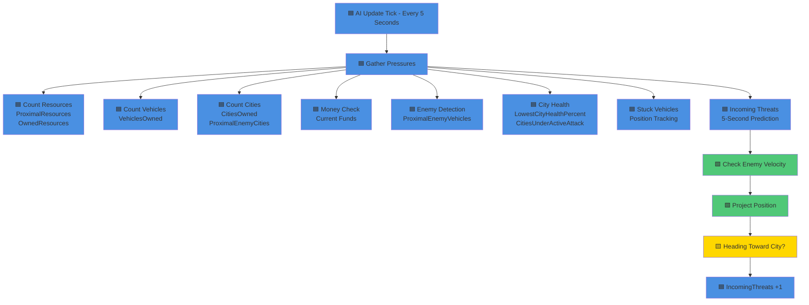
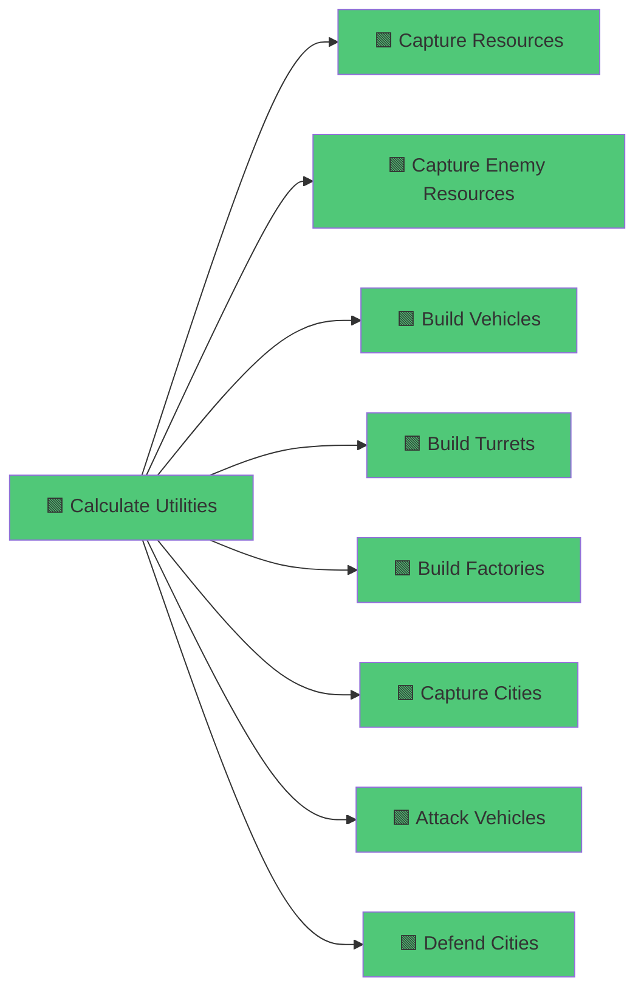
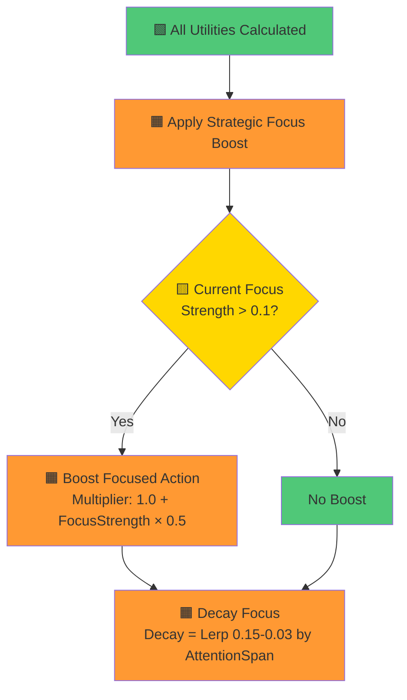
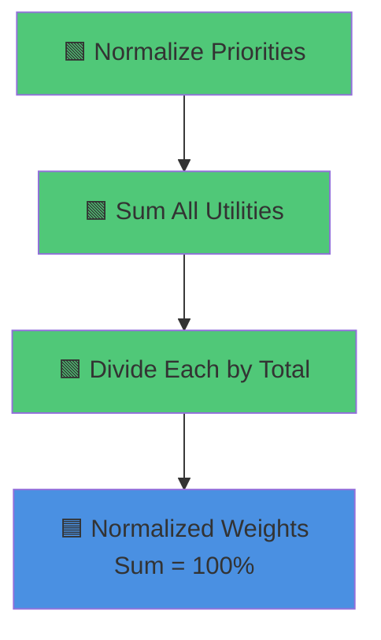
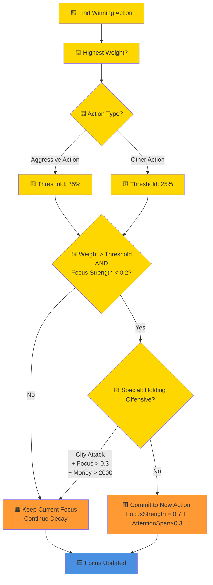
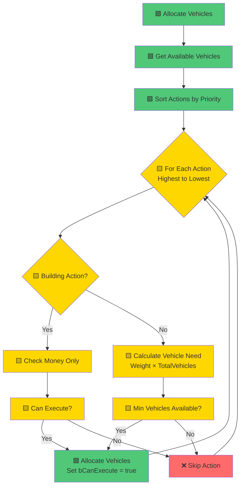
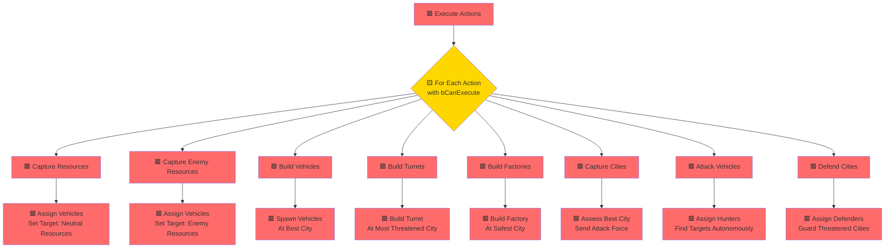
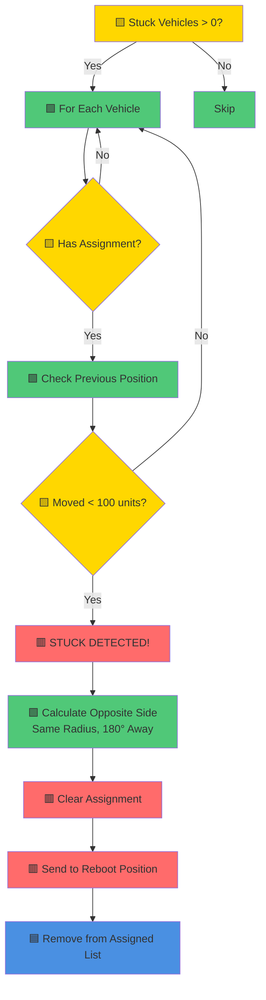

# AI Decision Tree - Planet Conquest

## System Overview

The AI makes decisions every **5 seconds** through a multi-stage pipeline. Below is the complete flow with color-coding:

- 🟦 **Blue** = Input/Data Gathering
- 🟩 **Green** = Calculation/Processing  
- 🟨 **Yellow** = Decision Points
- 🟧 **Orange** = Modifiers/Boosts
- 🟥 **Red** = Execution/Actions

---

## 📊 Stage 1: Pressure Gathering (Environmental Sensors)



---

## 🧮 Stage 2: Utility Calculations (Decision Scoring)

Each action gets a **utility score** based on personality and pressures:



### 🎯 Detailed Utility Formulas

#### 1️⃣ Capture Resources
```
Base = 0.7 + (Greed × 0.3)
ProximityBonus = ProximalResources / 8.0 (Linear)
SaturationPenalty = 1 - (OwnedResources / 10.0) (Linear)
MoneyNeed = 1 - (Money / 2000) (Sigmoid)

UTILITY = Base × (1 + ProximityBonus) × Saturation × (1 + MoneyNeed) × PersonalityModifier

PersonalityModifier:
- Overextender (Aggression×Greed>0.6): 1.2×
- Turtle (Greed×Defensiveness>0.6): 0.8×
```

#### 2️⃣ Build Vehicles
```
Base = 0.5
SafetyBonus = 1 - (CitiesUnderAttack / 3.0) (Exponential)
MoneyAvailable = (Money - 1000) / 2000 (Sigmoid)

UTILITY = Base × (1 + SafetyBonus) × MoneyAvailable
```

#### 3️⃣ Build Turrets  
```
Base = 0.2 + (Defensiveness × 0.3)

REQUIRES: CitiesUnderAttack > 0 OR ProximalEnemyVehicles > 3
OTHERWISE: UTILITY = 0

ThreatLevel = ProximalEnemyVehicles / 10.0 (Exponential)
UnderAttackUrgency = CitiesUnderAttack / 3.0 (Exponential) × 2.0
VulnerabilityBonus = (1 - LowestCityHealth) × 2.0 IF health < 0.8

Urgency = MAX(UnderAttackUrgency, ThreatLevel + Vulnerability)
MoneyAvailable = (Money - 2500) / 3500 (Sigmoid)

UTILITY = Base × Urgency × MoneyAvailable
```

#### 4️⃣ Build Factories
```
Base = 0.5 + (Greed × 0.4)
TotalFactories = Count all city factories
Saturation = 1 - (TotalFactories / 15.0) (Linear)
CurrentIncome = (Resources + Cities + Factories) × 100
IncomeNeed = 1 - (CurrentIncome / 1000) (Sigmoid)
MoneyAvailable = (Money - 3000) / 2000 (Sigmoid)
SafetyFactor = 1 - (CitiesUnderAttack × 0.2)

UTILITY = Base × (0.5 + Saturation) × (0.5 + IncomeNeed) × MoneyAvailable × SafetyFactor × PersonalityModifier

PersonalityModifier:
- Turtle Economy (Greed×Defensiveness>0.6): 1.2×
```

#### 5️⃣ Capture Cities
```
Base = Aggression

FOR EACH enemy city:
    Assess Strength = CityHP + TurretHP + TurretThreat + DefenderThreat
    Assess Resources = Count within 3000 units
    WeaknessFactor = 1 - (Strength / 5000) [clamped 0.1-1.0]
    ResourceFactor = 0.5 + (Resources × 0.2) [max 1.5]
    StrategicValue = Weakness × Resources
    
    VehiclesNeeded = Strength / 150 [min 3]
    ConfidenceRatio = AvailableVehicles / VehiclesNeeded
    TargetScore = (Confidence × 0.7) + (StrategicValue × 0.3)

BestTarget = Highest TargetScore
BestConfidence = Target's confidence ratio

Confidence Scaling:
- >= 1.5: ConfidenceFactor = 1.0 (full confidence)
- 1.0-1.5: ConfidenceFactor = (Confidence - 1.0) × 2.0
- 0.7-1.0: ConfidenceFactor = (Confidence - 0.7) × 1.5 × Aggression (only if Aggression > 0.7)
- < 0.7: ConfidenceFactor = 0 (no attack)

Opportunity = ProximalEnemyCities / 5.0 (Linear)
DefensivenessPenalty = 1 - (Defensiveness × 0.5)

UTILITY = Base × ConfidenceFactor × (1 + Opportunity × 0.3) × DefensivenessPenalty × PersonalityModifier

PersonalityModifier:
- Overextender (Aggression×Greed>0.6) + VehiclesOwned<8: 0.7× (penalty)
- Fortress (Aggression×Defensiveness>0.6) + VehiclesOwned>12: 1.3× (bonus)
```

#### 6️⃣ Defend Cities
```
Base = 0.6 + (Defensiveness × 0.4)

Threat = ProximalEnemyVehicles / 10.0 (Exponential)
IncomingThreatBonus = IncomingThreats / 5.0 (Linear) × 1.5
ActiveAttackUrgency = CitiesUnderAttack / 3.0 (Exponential) × 3.0
VulnerabilityBonus = (1 - LowestCityHealth) × 2.0 IF health < 0.8

FOR EACH damaged city:
    DamageRatio = 1 - (CurrentHealth / MaxHealth)
    DamagedCityBonus += DamageRatio × 1.5

CityValue = CitiesOwned / 5.0 (Linear)

UTILITY = Base × (1 + Threat + IncomingThreat + ActiveAttack + Vulnerability + DamagedCity) × CityValue × PersonalityModifier

PersonalityModifier:
- Fortress (Aggression×Defensiveness>0.6): 1.2×
```

#### 7️⃣ Attack Vehicles
```
Base = (Aggression × 0.7) + (Defensiveness × 0.3)
Opportunity = ProximalEnemyVehicles / 15.0 (Linear)
VehicleReadiness = VehiclesOwned from 4-12 (Sigmoid)
Superiority = OurVehicles / EnemyVehicles [clamped 0.5-1.5]

UTILITY = Base × (1 + Opportunity) × VehicleReadiness × Superiority
```

#### 8️⃣ Capture Enemy Resources
```
Base = 0.5 + (Aggression × 0.3) + (Greed × 0.2)
EnemyResourcesNearby = Count enemy-owned resources in range
Opportunity = EnemyResourcesNearby / 5.0 (Linear)
VehicleReadiness = VehiclesOwned from 3-10 (Sigmoid)
ConflictWillingness = 1 - (Defensiveness × 0.3)

UTILITY = Base × (1 + Opportunity) × VehicleReadiness × ConflictWillingness × PersonalityModifier

PersonalityModifier:
- Overextender (Aggression×Greed>0.6): 1.2×
- Turtle (Greed×Defensiveness>0.6): 0.8×
```

---

## 🎯 Stage 3: Strategic Focus (Commitment System)



**Focus Strength Dynamics:**
- Starts at `0.7 + (AttentionSpan × 0.3)` when committed
- Decays each update by `Lerp(0.15, 0.03, AttentionSpan)`
- High AttentionSpan = slower decay, stronger commitment

---

## ⚖️ Stage 4: Normalization



Example output:
- Resources: 35%
- Factories: 25%
- Cities: 20%
- Defense: 15%
- Vehicles: 5%
- (etc.)

---

## 🎲 Stage 5: Update Strategic Focus



**Aggressive Actions:** Capture Cities, Attack Vehicles, Capture Enemy Resources  
**Special Rule:** Won't abandon city offensive unless low on resources

---

## 🎯 Stage 6: Vehicle Allocation



---

## ⚡ Stage 7: Action Execution



### Execution Details:

#### 🏗️ Build Actions (Immediate):
- **Build Vehicles**: Spawn at city with best strategic position
- **Build Turrets**: Build at most threatened/damaged city
- **Build Factories**: Build at safest city (fewest nearby threats)

#### 🚗 Vehicle Assignment Actions:
Vehicles are marked with:
- `AssignedAction` = Action type
- `bHasAssignment` = true
- `AIController` = This AI controller

Then they **autonomously find targets** via their own `FindNextTarget()` logic.

#### ⚔️ Special: City Attack
```
1. Assess ALL enemy cities (strength + resources)
2. Find best target (70% confidence + 30% strategic value)
3. Calculate vehicles needed
4. Calculate overkill ratio = 1.2 + (Aggression × 0.3)
5. Send VehiclesNeeded × OverkillRatio
6. All attackers target SAME city
```

---

## 🔄 Stage 8: Stuck Vehicle Recovery



---

## 🧬 Personality Archetypes

Based on trait combinations, AIs develop distinct behaviors:

### 🗡️ Overextender (High Aggression × High Greed)
- **Strengths:**
  - +20% resource capture speed
  - +20% enemy resource capture
- **Weaknesses:**
  - -30% city attack when weak (<8 vehicles)
  - Tends to spread thin
  
### 🏰 Fortress (High Aggression × High Defensiveness)  
- **Strengths:**
  - +30% city attack when strong (>12 vehicles)
  - +20% defense priority
- **Behavior:**
  - Builds up forces before attacking
  - Heavily defends territory
  
### 🐢 Turtle Economy (High Greed × High Defensiveness)
- **Strengths:**
  - +20% factory building
- **Weaknesses:**
  - -20% enemy resource capture (stays close to home)
- **Behavior:**
  - Economic powerhouse
  - Risk-averse expansion

### ⚖️ Balanced (Medium All Traits)
- No strong modifiers
- Adapts to situations
- Most flexible playstyle

---

## 📈 Complete Pipeline Summary

```
Every 5 Seconds:
1. 🟦 Gather Pressures (8 types of environmental data)
2. 🟩 Calculate 8 Utility Scores (personality + pressures + modifiers)
3. 🟧 Apply Strategic Focus Boost (commitment to current strategy)
4. 🟩 Normalize to 100% (convert utilities to weights)
5. 🟨 Update Strategic Focus (commit to new strategy if decisive win)
6. 🟩 Allocate Vehicles (distribute based on weights)
7. 🟥 Execute Actions (spawn buildings, assign vehicle missions)
8. 🟧 Detect & Recover Stuck Vehicles (reboot to opposite side)
```

**Key Features:**
- ✅ Economic awareness (ROI calculations)
- ✅ Threat prediction (5-second lookahead)
- ✅ Strategic commitment (won't flip-flop strategies)
- ✅ Dynamic target selection (weakness + resources)
- ✅ Personality-driven modifiers (emergent behaviors)
- ✅ Stuck vehicle recovery (prevent deadlocks)

---

## 🎮 Example Decision Flow

**Scenario:** AI with Aggression=0.8, Greed=0.6, Defensiveness=0.3

**Pressures:**
- Money: $3500
- Vehicles: 10
- Cities: 2
- Resources: 4
- Enemy Vehicles Nearby: 6
- Cities Under Attack: 0
- Incoming Threats: 2

**Utility Calculations:**
1. **Capture Resources:** Base 0.88 × modifiers = **0.45**
2. **Build Factories:** Base 0.74 × modifiers = **0.52**
3. **Capture Cities:** Base 0.8 × Confidence 1.2 × modifiers = **0.85** ⭐
4. **Defend Cities:** Base 0.72 × (1 + Incoming 0.6) = **0.68**
5. Others: <0.4

**Strategic Focus:**
- Current: Capture Cities (strength 0.5)
- Winning Action: Capture Cities (85% after normalization)
- Decision: **HOLD COMMITMENT** (offensive doing well, money >$2000)
- Boost: 0.85 × (1 + 0.5×0.5) = **1.06** (boosted!)

**Allocation:**
- 50% of vehicles (5) → City Attack
- 25% of vehicles (2-3) → Defense  
- 15% of vehicles (1-2) → Resources
- 10% reserved

**Execution:**
- Assess enemy cities, find weak target with 3 resources nearby
- Send 6 vehicles (5 needed × 1.2 overkill)
- Log: "AI Team 1: Attacking CityB with 6 vehicles (needed 5, confidence 2.0x, strength 750, resources 3)"

---

## 🎯 Key Takeaways

1. **Utility-Based AI:** Every decision is scored numerically
2. **Personality Matters:** Same situation = different decisions based on traits
3. **Strategic Commitment:** Won't abandon winning strategies easily
4. **Resource-Aware:** Targets weak cities with high resource value
5. **Predictive Defense:** Defends against threats before they arrive
6. **Self-Correcting:** Recovers stuck vehicles automatically

The system creates **emergent strategies** without hard-coded decision trees!
